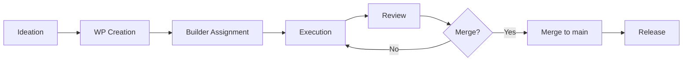

# AOA Shipping SOP
**Version**: 0.1
**Date**: 2026-08-22
**Owner**: @kgabelev

---

## 📌 Purpose
This document defines the **standard operating procedure (SOP)** for shipping features, fixes, and artifacts in AOA. It ensures consistency, traceability, and quality across all work packages (WPs).

---

## 🚀 Workflow Overview

### 1. **Work Package (WP) Creation**
- Every task (feature, fix, or artifact) must have a **Work Package (WP)**.
- Use the [Work Package Template](WORK-PACKAGE-TEMPLATE.md) to define the WP.
- Assign the WP to a builder (human or AI).

### 2. **Builder Execution**
- The builder follows the **Definition of Done (DoD)** for the WP.
- The builder commits:
  - Artifacts (e.g., code, docs, data).
  - Tests (automated or manual).
  - Evidence (e.g., logs, benchmarks, screenshots).

### 3. **Review**
- A human reviewer verifies the **DoD checklist**.
- The reviewer approves or requests changes.

### 4. **Merge**
- Only merge after all gates pass.
- Use **squash merges** to keep history clean.

---

## 📝 Work Package (WP) Lifecycle



---

## 📋 Work Package Template
Use the following template for every WP. See [WORK-PACKAGE-TEMPLATE.md](WORK-PACKAGE-TEMPLATE.md) for a reusable template.

```markdown
## WP-[ID] — [Title]
**Status**: [Draft/In Progress/Review/Done]
**Priority**: [High/Medium/Low]
**Assigned To**: [Builder Name/ID]

---

### 🎯 Objective
[What this WP achieves.]

### 🤔 Why This Exists
[How it reduces risk or adds value to AOA.]

### 📚 Canonical Sources
- [Link to decision records, docs, or issues.]

---

### 📥 Inputs
[Files, data, or resources required to complete this WP.]

### 📤 Required Outputs
[Artifacts, code, docs, or data to produce.]

---

### 📁 Files Allowed to Change
- [List of files/directories that may be modified.]

### 🚫 Files Forbidden to Change
- [List of files/directories that must not be modified.]

---

### ✅ Acceptance Tests
- [ ] Test 1 (e.g., `pytest tests/wp-[id].py`)
- [ ] Test 2

### 📌 Definition of Done (DoD)
- [ ] Artifact exists in the correct location.
- [ ] Tests exist and pass.
- [ ] Required evidence (e.g., benchmarks, logs) is committed.
- [ ] Repo state reflects completion (no uncommitted changes).
- [ ] Documentation is updated (if applicable).
- [ ] Reviewer approval obtained.

---

### 📎 Evidence Required
- [Screenshots, logs, benchmarks, or other evidence.]

### ⚠️ Known Limitations
- [Any known limitations or edge cases not addressed in this WP.]

### 🔗 Dependencies
- [Other WPs or tasks that must be completed first.]

### 🚨 Escalation Conditions
- [Conditions under which this WP should be escalated (e.g., "If recall < 75%, escalate to @kgabelev").]
```

---

## ✅ Definition of Done (DoD) Checklist
For a WP to be considered **Done**, all of the following must be true:

### 1. **Artifact Existence**
- [ ] The artifact (e.g., file, code, doc) exists in the correct location.

### 2. **Tests**
- [ ] Automated tests exist for the artifact.
- [ ] All tests pass.

### 3. **Evidence**
- [ ] All required evidence (e.g., benchmarks, logs, screenshots) is committed to the repo.

### 4. **Repo State**
- [ ] No uncommitted changes in the working directory.
- [ ] Branch is up-to-date with `main`.

### 5. **Documentation**
- [ ] README or relevant docs are updated (if applicable).

### 6. **Review**
- [ ] Approved by at least one human reviewer.

---

## 🤖 Agent Handoff Protocol
When transitioning work between builders (human or AI), follow this protocol:

### 1. **Current Builder**
- Documents progress in the WP.
- Lists open questions or blockers.
- Commits all intermediate work (e.g., `scratch/*.py`, logs).

### 2. **Next Builder**
- Reviews the WP and all evidence.
- Confirms understanding of the task and open questions.
- Starts execution only after confirmation.

### 3. **Handoff Artifacts**
- All intermediate files (e.g., `scratch/*.py`, `logs/*.txt`).
- Debug output or error logs.
- Notes on edge cases or assumptions.

---

## 🚪 Release Gates
The following gates must be passed before merging or releasing:

### WP-001 (Release Contract)
- **Gate**: Frozen before any engineering begins.
- **Criteria**: All scope and non-goals are explicitly defined.

### WP-002 (AOA-Bench)
- **Gate**: 30 holdout cases frozen before semantic tuning.
- **Criteria**: 60 cases (30 dev, 30 holdout) with overlapping examples of all defect types.

### WP-003 (Claim Ledger)
- **Gate**: Schema + taxonomy frozen before development.
- **Criteria**: Schema tests pass; all bounded states are defined.

### WP-009 (Locked Evaluation)
- **Gate**: Must pass all evaluation gates before beta.
- **Criteria**:
  - ≥75% material-defect recall
  - ≥85% high-severity precision
  - 100% deterministic arithmetic correctness
  - 0 `supported` findings without displayed evidence
  - 100% judgment-dependent cases routed away from fabricated factual certainty

---

## 📚 References
- [Work Package Template](WORK-PACKAGE-TEMPLATE.md)
- [Agent Handoff Protocol](AGENT-HANDOFF-PROTOCOL.md)
- [Definition of Done Checklist](DEFINITION-OF-DONE-CHECKLIST.md)
- [Release Contract](../../RELEASE_CONTRACT.md)