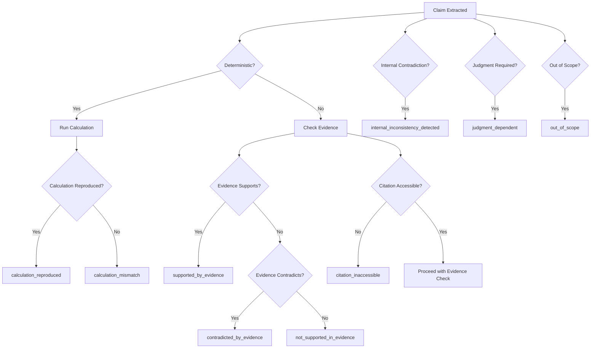

# AOA Status Taxonomy (v0.1)
**Status**: FROZEN
**Date**: 2026-08-22
**Owner**: @kgabelev

---

## 📌 Overview
This document defines the **bounded states** for claims, evidence, and findings in AOA. These states ensure precision and avoid ambiguous terms like "VERIFIED."

---

## 🏷️ Bounded States

| **Status**                          | **Description**                                                                                     | **Example**                                                                 |
|------------------------------------|-----------------------------------------------------------------------------------------------------|-----------------------------------------------------------------------------|
| `calculation_reproduced`           | The calculation was reproduced exactly.                                                           | `"2 + 2 = 4"` (evidence: `2 + 2 = 4`).                                     |
| `calculation_mismatch`             | The calculation does not match the evidence.                                                     | `"2 + 2 = 5"` (evidence: `2 + 2 = 4`).                                     |
| `supported_by_evidence`            | The claim is explicitly supported by the supplied evidence.                                      | `"Revenue was $10M"` (evidence: 10-K p. 45: `$10M`).                       |
| `contradicted_by_evidence`        | The claim is explicitly contradicted by the supplied evidence.                                   | `"Revenue was $15M"` (evidence: 10-K p. 45: `$10M`).                       |
| `not_supported_in_evidence`       | The claim is not addressed in the supplied evidence.                                             | `"The CFO is a CFE"` (evidence: LinkedIn profile with no CFE mention).     |
| `citation_inaccessible`           | The citation URL cannot be accessed (e.g., 404, timeout).                                         | `"See [report.pdf](https://example.com/report.pdf)|` (URL returns 404).    |
| `citation_relevant_support_unresolved` | The citation is relevant, but the passage does not clearly support/contradict the claim. | `"Revenue grew"` (evidence: "Revenue trends are positive").                |
| `internal_inconsistency_detected`| The claim contradicts another claim in the same output.                                         | `"Revenue was $10M"` and `"Revenue was $11M"` in the same answer.          |
| `judgment_dependent`               | The claim requires human judgment (e.g., opinions, forecasts).                                  | `"The stock will rise in 2027."`                                            |
| `out_of_scope`                    | The claim is outside the scope of v0.1 (e.g., legal advice).                                     | `"This is GAAP-compliant."`                                                 |

---

## 📜 Rules

1. **No "VERIFIED"**: Always use precise states (e.g., `supported_by_evidence`).
2. **Retrieval failure ≠ Unsupported**: Use `citation_inaccessible` or `unable_to_assess` instead of assuming the claim is unsupported.
3. **Judgment-dependent**: Always route to human review. Never mark as `supported_by_evidence` or `contradicted_by_evidence`.
4. **Traceability**: Every status must be backed by evidence or a clear rationale.

---

## 🔄 State Transitions

---

## 📚 References
- [Claim Ledger Schema](../schemas/claim-ledger.schema.json)
- [Release Contract](../RELEASE_CONTRACT.md)
- [AOA-Bench](../benchmark/README.md)